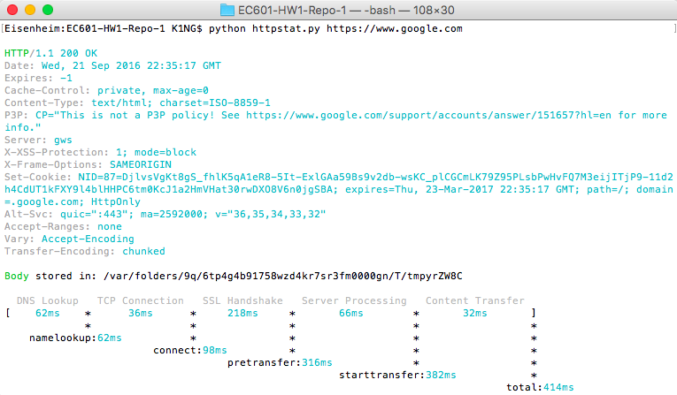
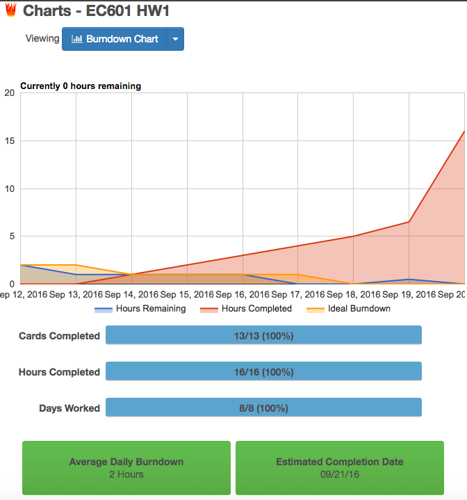

# EC601-HW1-Repo

# httpstat with display changes

Simple cURL statistics made to look better!

Group members: ssingh02@bu.edu and cykang@bu.edu




<<<<<<< HEAD
Our update to httpstat is still a **single file** Python script just like the original httpstat that has **no dependency** and is compatible with **Python**. We have made simple changes to how statistics are displayed to the user. Some of the changes are displayed in the screenshot above.
=======
Our update to httpstat is still a **single file** Python script just like the original httpstat that has **no dependency** and is compatible with **Python 3**. We have made simple changes to how statistics are displayed to the user. Some of the changes are displayed in the screenshot above.
>>>>>>> new-way-to-display-data


## Installation

This is how to can get `httpstat with display changes`:

- Download the script directly: `wget https://raw.githubusercontent.com/saurabh21289/EC601-HW1-Repo-1/master/httpstat.py`


## Usage

Pass the URL you want statistics about as a parameter to httpstats.py file

```bash
python httpstat.py http://www.google.com
```
or to get the https version of the site over port 443:

```bash
python httpstat.py https://www.google.com
```

## Trello Cards

You can see the tasks assigned as Trello Cards in the pdf file https://raw.githubusercontent.com/saurabh21289/EC601-HW1-Repo-1/master/EC601_HW1_Trello.pdf

## Burndown Chart

The Burndown Chart for HW1 Sprint is shown below:


